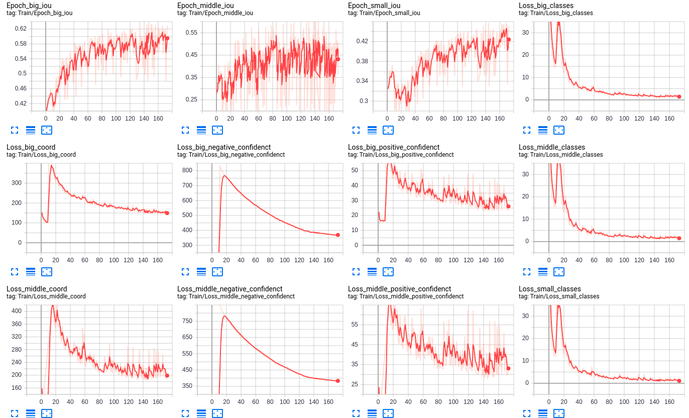

# YOLOv3 FaceDetection  
只需要将WiderFace数据集和COCO2014数据集以如下方式组织即可：  
--DataSet 数据集  
----WiderFace WiderFace数据集  
------WIDER_train WiderFace训练集  
--------images 数据集图片  
--------wider_face_train_bbx_gt.txt 训练集标注数据  
------WIDER_val WiderFace验证集  
--------images 数据集图片  
--------wider_face_val_bbx_gt.txt 验证集标注数据  
----COCO2014 COCO2014数据集文件夹  
------Train 训练集  
--------Images 图片  
--------Labels YOLO格式的txt标注文件  
------Val 验证集  
--------Images 图片  
--------Labels YOLO格式的txt标注文件  

# Introduction  

# Code structure 
--result 模型性能结果图片保存  
--DataSet 数据集  
----WiderFace WiderFace数据集  
------WIDER_train WiderFace训练集  
--------images 数据集图片  
--------wider_face_train_bbx_gt.txt 训练集标注数据  
------WIDER_val WiderFace验证集  
--------images 数据集图片  
--------wider_face_val_bbx_gt.txt 验证集标注数据  
----COCO2014 COCO2014数据集文件夹  
------Train 训练集  
--------Images 图片  
--------Labels YOLO格式的txt标注文件  
------Val 验证集  
--------Images 图片  
--------Labels YOLO格式的txt标注文件  
--Detection 检测功能调用模块  
----YOLO_V3_ImageDetection.py 调用模型进行图片的检测  
--PreTrain 预训练模块  
----log tensorboardX日志  
----weights 权重文件保存  
----COCO_Classify.py 使用COCO数据集进行分类任务的DataSet类重写  
----DarkNet53.py  darknet-53网络结构定义  
----DarkNet53-Train.py darknet-53网络训练  
----DarkNet53-FromRecord.py darknet-53网络恢复中断训练  
----Extract_Final_Model.py 从保存的pth文件中提取模型权重参数
--Train 训练模块  
----log tensorboardX日志  
----weights 权重文件保存  
----Anchor_Kean_Means.py 聚类得到Anchor 尺度
----Extract_Final_Model.py 从保存的pth文件中提取模型权重参数  
----WiderFace_DataSet.py 使用WiderFace进行训练定义的DataSet类  
----YOLO_V3_Model.py YOLOv3模型定义  
----YOLO_V3_Train.py YOLOv3训练  
----YOLO_V3_FromRecord.py YOLOv3恢复中断训练  
----YOLO_V3_LossFunction.py YOLOv3损失函数  
--utils 自定义工具包  
----image 用于处理图像增强的一些方法  
----model 对模型冻结和解冻的一些方法定义  

# Usage  
To install requirements:  
pip install -r requirements.txt  
本项目使用的预训练数据集为COCO2014,检测训练使用的是WiderFace数据集。预训练入口为DarkNet53-Train.py,检测训练入口为YOLO_V3_Train.py，直接python运行即可。  

# Evaluation  
训练指标使用tensorboardX保存在日志文件里,无需额外调用脚本进行评估。性能存在波动是因为YOLOv3的多尺度训练技巧导致的，但是即便如此，性能的提升趋势还是显而易见的。另外，在epoch=10的时候发生了大幅度波动是因为在前10个epoch中，模型的backbone是固定不参加训练的，从epoch=10开始全网络参与训练，因此会出现大波动，后期已收敛稳定。  

# Pre-trained Models  
预训练模型保存在PreTrain/weights里。  

# Results
模型结果  
  

  

  

  

# Contributing

